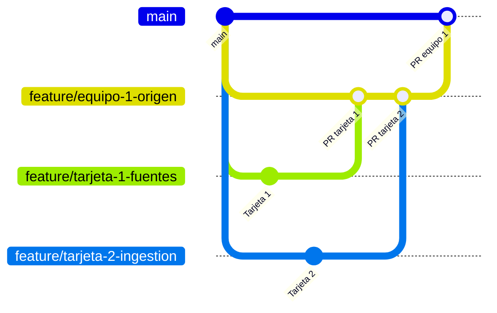

# 🌐 Los 5 Pilares del Ciclo de Vida del Dato

Práctica de colaboración en GitHub: cada equipo construye una página de la web y cada alumno/a escribe **una tarjeta**,
siguiendo el ciclo **issue → rama → commit → pull request → review → merge**, organizado en el **Project** del repo.

Duración aproximada: 45–60 min.

---

## 🃏 Tarjetas

Cada equipo tiene una página con 4 tarjetas ya preparadas. Cada persona elige **una** (si sois más de 4, trabajad en pareja) y será su **subtarea**. Despliega tu equipo para ver el contenido:

<details>
<summary><b>Equipo 1 · Origen y Captura</b> · <code>data-origin/data-origin.html</code></summary>

1. **Fuentes estructuradas y no estructuradas**
   - `<h3>`: Datos ordenados y datos caóticos
   - `<p>`: Las fuentes estructuradas (bases de datos, APIs, ERP) tienen un formato fijo de filas y columnas. Las no estructuradas (logs, sensores, redes sociales) llegan como texto, imágenes o eventos y hay que procesarlas antes de usarlas.

2. **Recolección e ingestión**
   - `<h3>`: Cómo entran los datos al sistema
   - `<p>`: La ingestión es el proceso de traer datos desde su origen a un almacén central. Puede hacerse por lotes (batch), por ejemplo cada noche, o en tiempo real (streaming), a medida que los datos se generan.

3. **Data Governance**
   - `<h3>`: Reglas del juego para los datos
   - `<p>`: El gobierno del dato define quién es responsable de cada dato, quién puede acceder y con qué calidad mínima debe estar. Sin estas reglas, cada equipo acaba con su propia versión de la verdad.

4. **Metadatos y procedencia**
   - `<h3>`: Datos sobre los datos
   - `<p>`: Los metadatos describen un dato: su origen, su formato, cuándo se creó y quién lo modificó. La procedencia (data lineage) permite rastrear de dónde viene cada cifra de un informe.

</details>

<details>
<summary><b>Equipo 2 · Limpieza y Transformación</b> · <code>data-cleaning/data-cleaning.html</code></summary>

1. **Data Wrangling y calidad**
   - `<h3>`: Ordenar antes de analizar
   - `<p>`: El data wrangling consiste en limpiar, unificar y dar forma a los datos en bruto. Se calcula que ocupa gran parte del tiempo de un proyecto de datos, porque un análisis solo es tan bueno como los datos que usa.

2. **Valores nulos y outliers**
   - `<h3>`: Huecos y valores extremos
   - `<p>`: Los valores nulos son datos que faltan y se pueden eliminar o rellenar (por ejemplo, con la media). Los outliers son valores muy alejados del resto: pueden ser errores o casos reales importantes, así que hay que revisarlos antes de borrarlos.

3. **ETL/ELT y pipelines**
   - `<h3>`: Extraer, transformar y cargar
   - `<p>`: ETL extrae los datos, los transforma y después los carga en el almacén. ELT los carga primero y los transforma dentro del almacén. Un pipeline automatiza estos pasos para que se ejecuten solos y siempre igual.

4. **Feature Engineering**
   - `<h3>`: Crear variables útiles
   - `<p>`: El feature engineering transforma los datos en variables que un modelo entiende mejor. Por ejemplo, a partir de una fecha se puede crear el día de la semana o si era festivo.

</details>

<details>
<summary><b>Equipo 3 · Análisis y Modelado</b> · <code>data-analysis/data-analysis.html</code></summary>

1. **Estadística descriptiva y visualización**
   - `<h3>`: Resumir y ver los datos
   - `<p>`: La estadística descriptiva resume los datos con medidas como la media, la mediana o la desviación típica. Los gráficos (histogramas, diagramas de dispersión) ayudan a detectar patrones que una tabla esconde.

2. **Machine Learning**
   - `<h3>`: Aprender a partir de ejemplos
   - `<p>`: En el aprendizaje supervisado el modelo aprende con ejemplos etiquetados, como emails marcados como spam o no spam. En el no supervisado busca estructura por sí mismo, sin etiquetas.

3. **Experimentación y validación**
   - `<h3>`: Comprobar que el modelo funciona
   - `<p>`: Para saber si un modelo generaliza, se entrena con una parte de los datos y se evalúa con otra que no ha visto. Técnicas como la validación cruzada y los tests A/B evitan conclusiones engañosas.

4. **Segmentación y patrones**
   - `<h3>`: Encontrar grupos ocultos
   - `<p>`: El clustering agrupa elementos parecidos sin saber de antemano qué grupos existen. Se usa, por ejemplo, para segmentar clientes según su comportamiento de compra.

</details>

<details>
<summary><b>Equipo 4 · Despliegue y Monitorización</b> · <code>deployment/deployment.html</code></summary>

1. **MLOps**
   - `<h3>`: Llevar modelos a producción
   - `<p>`: MLOps aplica las prácticas de DevOps a los modelos de machine learning: versionado, pruebas automáticas y despliegue continuo. Su objetivo es que un modelo pase del notebook a producción de forma fiable.

2. **Dashboards y reporting**
   - `<h3>`: Datos a la vista de todos
   - `<p>`: Un dashboard muestra los indicadores clave de forma visual y actualizada. Herramientas como Power BI, Tableau o Looker Studio permiten automatizar informes que antes se hacían a mano.

3. **Recomendación en tiempo real**
   - `<h3>`: Sugerencias al instante
   - `<p>`: Los sistemas de recomendación proponen productos o contenidos según el comportamiento del usuario. En tiempo real, el modelo responde en milisegundos mientras la persona navega, como en Netflix o Spotify.

4. **Monitorización y mantenimiento**
   - `<h3>`: Vigilar el modelo en producción
   - `<p>`: Con el tiempo los datos cambian y el modelo pierde precisión (data drift). Monitorizar sus métricas permite detectarlo a tiempo y reentrenarlo antes de que tome malas decisiones.

</details>

<details>
<summary><b>Equipo 5 · Impacto y Dirección Estratégica</b> · <code>strategic-direction/strategic-direction.html</code></summary>

1. **Storytelling con datos**
   - `<h3>`: Contar historias con datos
   - `<p>`: El storytelling combina datos, visualizaciones y narrativa para explicar un hallazgo. Una buena historia responde a qué ha pasado, por qué importa y qué decisión hay que tomar.

2. **ROI e impacto en negocio**
   - `<h3>`: ¿Merece la pena el proyecto?
   - `<p>`: El retorno de la inversión (ROI) compara el beneficio de un proyecto de datos con lo que ha costado. Medirlo ayuda a justificar nuevos proyectos y a priorizar los que más valor aportan.

3. **Retroalimentación y mejora**
   - `<h3>`: Aprender de los resultados
   - `<p>`: Los resultados de cada decisión generan nuevos datos que vuelven al inicio del ciclo. Este bucle de retroalimentación permite mejorar los modelos y los procesos de forma continua.

4. **Ética, privacidad y gobierno**
   - `<h3>`: Usar los datos con responsabilidad
   - `<p>`: Trabajar con datos implica respetar la privacidad de las personas y leyes como el RGPD. También hay que vigilar los sesgos de los modelos para que no discriminen a ningún colectivo.

</details>


Mira `examples/examples.html` para ver cómo queda una tarjeta terminada.

---

## 🧭 Cómo se trabaja



- **Tarea general** (un issue por equipo, ej. *Origen y Captura*) → su rama es el `develop` del equipo.
- **Subtareas** (un sub-issue por tarjeta, ej. *Recolección e ingestión*) → cada una con su rama, que sale de la rama del equipo.
- Las tarjetas se mergean en la rama del equipo y, cuando todo funciona, el equipo abre **un PR a `main`**.
- Todo se hace **desde el Project**: al pulsar un issue del tablero se abre en un panel lateral con todas las opciones.

### 🏷️ Nombres de las ramas

Todas las ramas empiezan por `feature/`, en minúsculas y **sin tildes ni espacios**. GitHub propone un nombre automático (`5-recolección-e-ingestión`): **bórralo y escribe el tuyo**.

| Rama | Nombre |
|---|---|
| Del equipo | `feature/equipo-<N>-<tema>` → `feature/equipo-1-origen` |
| De tu tarjeta | `feature/tarjeta-<N>-<tema>` → `feature/tarjeta-2-ingestion` |

---

## A. Tarea general (lo hace **una persona** del equipo)

1. Abre el **Project** (pestaña **Projects** del repo). En la columna **Todo** pulsa **+ Add item**, luego el **+** de la barra inferior → **Create new issue**.

   

2. Elige la plantilla **🗂️ Tarea de equipo**. Título: `Equipo 1 · Origen y Captura`.

   

3. Pulsa el issue en el tablero para abrirlo en el panel lateral. En **Development → Create a branch**, **en este orden**:
   1. **Repository destination** → elige el repo `IA-P1-BCN/hello_world_from_PR`.
   2. **Branch source** → deja `main`.
   3. **Branch name** → `feature/equipo-1-origen` → **Create branch**.

   Avisad a todo el equipo del nombre.

## B. Subtarea (lo hace **cada persona** con su tarjeta)

### 1. Crea tu subtarea

1. En el **Project**, abre la tarea general de tu equipo y pulsa **Create sub-issue → 🃏 Mi tarjeta**.

   

2. Título: el tema de tu tarjeta. Rellena el número de tarjeta, pulsa **Assignee** para asignártela y **Create**.

   

3. Abre tu subtarea en el tablero y, en el panel derecho, cambia **Status** a **In Progress**.

   

### 2. Crea tu rama a partir de la rama del equipo

En el panel de tu subtarea: **Development → Create a branch**. **En este orden**:

1. **Repository destination** → elige el repo `IA-P1-BCN/hello_world_from_PR`.
2. **Branch source** → elige **la rama del equipo** (⚠️ no `main`).
3. **Branch name** → `feature/tarjeta-<N>-<tema>`. Escríbelo al final: si cambias el repo después, el nombre se borra.
4. Deja **Checkout locally** y pulsa **Create branch**.


GitHub te muestra los comandos para traerte la rama:

```bash
git clone https://github.com/IA-P1-BCN/hello_world_from_PR.git
cd hello_world_from_PR
git fetch origin
git checkout feature/tarjeta-2-ingestion
```

### 3. Escribe tu tarjeta

Edita **solo** tu bloque `TARJETA N` en el HTML de tu equipo: copia el `<h3>` y el `<p>` de la sección **Tarjetas**.
Abre `index.html` en el navegador para comprobar cómo queda.

### 4. Commit y push

```bash
git add .
git commit -m "Añade tarjeta Recolección e ingestión"
git push -u origin feature/tarjeta-2-ingestion
```

### 5. PR a la rama del equipo

1. Pulsa **Compare & pull request**. ⚠️ GitHub pone **base: main** por defecto: cámbiala a **la rama del equipo**.

   

   Tiene que quedar así:

   

2. Pide revisión a un compañero/a en **Reviewers**. Quien revisa abre **Files changed**, pulsa **Submit review**, elige **Approve** y después hace el **merge**.

   

   > ℹ️ En la captura **Approve** sale desactivado porque GitHub no deja aprobar tu propio PR. Cuando lo abra un compañero/a, le aparecerá activo.

3. Cierra tu subtarea con **Close issue** (GitHub solo cierra issues solos cuando el merge es a `main`). Pasa a **Done** en el Project.

## C. PR del equipo a `main` (cuando **todas** las subtareas están cerradas)

1. Comprobad que todo funciona en la rama del equipo:

   ```bash
   git checkout feature/equipo-1-origen
   git pull
   ```

   Abrid `index.html` y revisad vuestra sección.
2. Abrid un PR de **la rama del equipo → `main`** con `Closes #<número-de-la-tarea-general>` en la descripción.
3. El/la instructor/a revisa y hace el merge. La tarea general se cierra y pasa a **Done**.

---

## 🆘 Problemas comunes

- **`git push` rechazado**: seguramente estás en `main`. Haz `git checkout <tu-rama>`.
- **El PR muestra cambios que no son tuyos**: tu rama salió de `main` o el PR apunta a `main`. Revisa la **base** del PR.
- **El PR tiene conflictos**: has editado fuera de tu bloque `TARJETA N`. Deshaz esos cambios.
- **Aviso _"The head ref may contain hidden characters"_**: tu rama tiene tildes. Usa nombres `feature/...` sin tildes.
- **No aparecen las plantillas de issue**: estás en otro repo. Revisa que la URL sea la de la organización del bootcamp.
